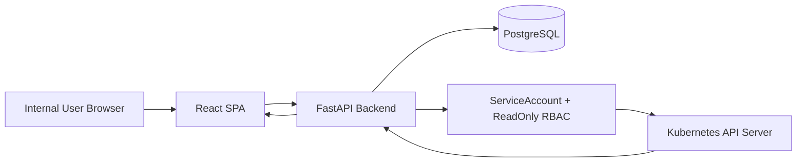
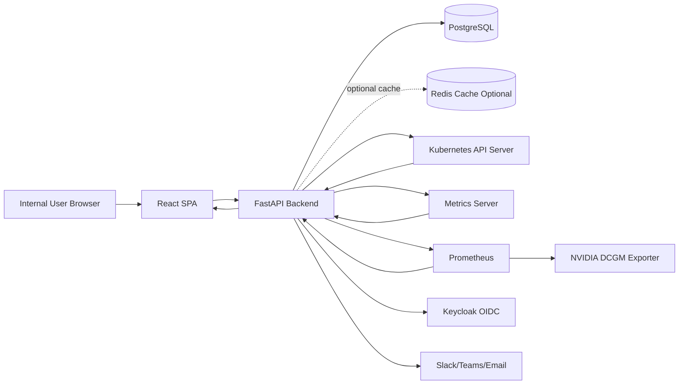
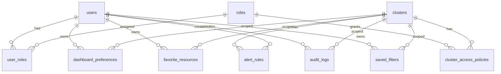
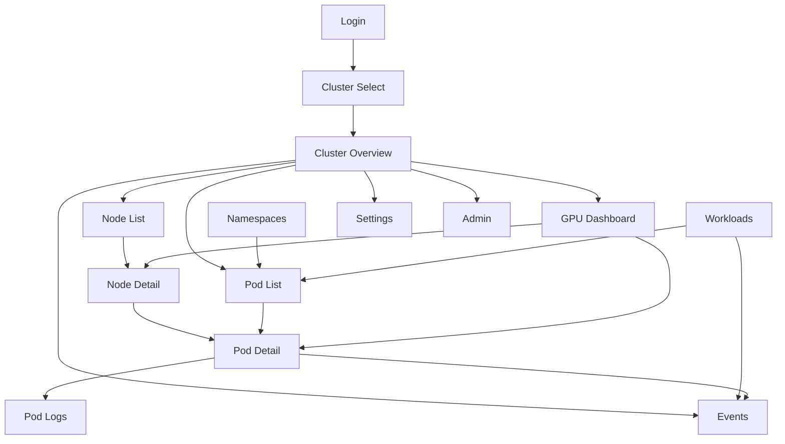

# Kubernetes ReadOnly Dashboard 프로젝트 기획/설계서

## 1. 앱 한 줄 요약

Kubernetes 클러스터의 Node, Pod, Workload, Event, Log, Resource, GPU 상태를 웹에서 쉽게 확인하는 사내 ReadOnly 관제 대시보드입니다.

---

## 2. 핵심 사용자

### 주요 사용자

- Kubernetes 초보 운영자
- MLOps 엔지니어
- Dataiku DSS 운영자
- GPU 클러스터 운영자
- 내부 인프라/플랫폼 운영팀

### 사용자별 문제

#### Kubernetes 초보 운영자

- `kubectl get`, `kubectl describe`, `kubectl logs` 명령어 사용이 익숙하지 않습니다.
- Pod가 Pending, Failed, CrashLoopBackOff 상태일 때 어디부터 봐야 할지 모릅니다.
- Namespace, Node, Deployment, Service 관계를 한눈에 이해하기 어렵습니다.

#### MLOps 엔지니어

- 학습/추론 Pod가 어느 Node에 배치되었는지 빠르게 확인해야 합니다.
- CPU, Memory, GPU 요청량과 실제 사용량을 보고 싶습니다.
- 모델 학습 Pod의 실패 원인을 Event와 Log로 빠르게 확인해야 합니다.

#### Dataiku 운영자

- Dataiku DSS가 생성한 Kubernetes 실행 Pod를 필터링해서 보고 싶습니다.
- Dataiku Job Pod가 Pending인지, Failed인지, 어느 GPU Node에서 실행 중인지 확인해야 합니다.
- Dataiku 사용자가 요청한 GPU 리소스와 실제 배치 상태를 확인해야 합니다.

#### GPU 클러스터 운영자

- H100, A30 같은 GPU가 어느 Node에 있는지 확인해야 합니다.
- 어떤 Pod가 GPU request/limit을 설정했는지 확인해야 합니다.
- NVIDIA Device Plugin, GPU Operator, DCGM Exporter, Prometheus 연동 상태를 점검해야 합니다.
- GPU 리소스 부족, Node 장애, DiskPressure 같은 운영 이슈를 빨리 파악해야 합니다.

---

## 3. 핵심 기능

### MVP에서 반드시 필요한 기능

1. 클러스터 Overview
   - 전체 Node 수
   - Namespace 수
   - Pod 상태별 개수
   - Deployment 수
   - Service 수
   - 최근 Warning Event
   - GPU Node 수
   - GPU 요청 Pod 수

2. Node 목록/상세
   - Node 이름, 상태, Role, Kubernetes 버전, OS, container runtime 표시
   - CPU/Memory capacity, allocatable 표시
   - GPU allocatable 표시
   - Node Condition 표시
   - 해당 Node에 배치된 Pod 목록 표시

3. Namespace 목록
   - Namespace 목록 표시
   - Namespace별 Pod 수, 상태 요약
   - Namespace 필터

4. Pod 목록/상세
   - Pod 이름, Namespace, 상태, Node, Restart count, 생성 시간 표시
   - Label/Annotation 주요 정보 표시
   - Container 상태 표시
   - Resource request/limit 표시
   - GPU request/limit 표시
   - Pod가 배치된 Node 확인

5. Deployment 목록/상세
   - Replicas, Ready replicas, Available replicas 표시
   - Selector, Label 표시
   - 연결된 Pod 목록 표시

6. Service 목록/상세
   - ClusterIP, NodePort, LoadBalancer, ExternalName 표시
   - Port, TargetPort 표시
   - Selector 기반 연결 Pod 확인

7. Event 조회
   - Namespace별 Event 목록
   - Warning Event 필터
   - Pod 상세 화면에서 관련 Event 표시

8. Pod 로그 조회
   - Pod/Container 선택 후 최근 로그 조회
   - tail line 제한
   - ReadOnly 조회만 제공

9. Pod 상태별 필터링
   - Running, Pending, Failed, Succeeded, Unknown
   - CrashLoopBackOff, ImagePullBackOff, ErrImagePull 같은 Container waiting reason 표시

10. GPU request/limit 표시
   - `nvidia.com/gpu` request/limit 표시
   - GPU 요청 Pod 필터
   - GPU Node 여부 표시

### 나중에 추가하면 좋은 기능

1. Metrics Server 기반 CPU/Memory 사용량
2. Prometheus 연동
3. DCGM Exporter 기반 GPU 사용률, 메모리 사용량, 온도, 전력 사용량
4. DiskPressure, MemoryPressure, PIDPressure 감지
5. Pod 재시작 원인 분석
6. Dataiku Pod 필터링
   - Namespace 기반
   - Label/Annotation 기반
   - Pod 이름 패턴 기반
7. 알림 기능
   - Slack, Teams, Email
   - Warning Event 알림
   - GPU 부족 알림
8. Keycloak OIDC 로그인
9. 관리자 기능
   - 사용자 관리
   - 권한 관리
   - 클러스터 연결 관리
10. 멀티 클러스터 지원
11. Audit Log 조회
12. 리소스 즐겨찾기
13. 저장된 검색 조건
14. Ingress 목록/상세
15. ConfigMap/Secret 메타데이터 조회
    - Secret 값은 절대 표시하지 않음

### 없어도 되는 기능

MVP에서는 다음 기능을 만들지 않습니다.

- Pod 삭제
- Deployment 스케일 변경
- YAML 직접 수정
- 실시간 터미널 접속
- 클러스터 생성 기능
- Helm Chart 설치 기능
- Secret 값 조회/다운로드
- PVC 삭제
- Node cordon/drain
- 관리자 권한으로 리소스 수정
- CI/CD 배포 기능

---

## 4. 추천 기술 스택

| 항목 | 추천 기술 | 추천 이유 |
|---|---|---|
| 프론트엔드 | React + Vite + TypeScript | Next.js보다 구조가 단순하고 내부 관제 SPA에 적합합니다. 빠른 개발, 유지보수, 배포가 쉽습니다. |
| UI | Tailwind CSS + shadcn/ui | 깔끔한 관리자 UI를 빠르게 만들 수 있고 컴포넌트 커스터마이징이 쉽습니다. |
| Table | TanStack Table | Pod, Node, Event처럼 컬럼과 필터가 많은 목록 화면에 적합합니다. |
| Chart | Recharts | Overview, GPU, Metrics 그래프 구현이 쉽습니다. |
| 백엔드 | FastAPI + Python | Kubernetes Python Client와 조합이 좋고 API 문서 자동 생성이 쉽습니다. |
| Kubernetes Client | Python Kubernetes Client | Kubernetes API 조회, logs, events, RBAC 기반 접근에 적합합니다. |
| 데이터베이스 | PostgreSQL | 사용자, 권한, 설정, 즐겨찾기, 감사 로그 저장에 안정적입니다. |
| ORM/마이그레이션 | SQLAlchemy 2.x + Alembic | FastAPI와 궁합이 좋고 스키마 변경 관리가 쉽습니다. |
| 인증 방식 | MVP: 사내망 + 세션/JWT 간단 로그인, 확장: Keycloak OIDC | 처음에는 단순하게 시작하고 운영 단계에서 SSO로 확장합니다. |
| 파일 저장소 | MVP 불필요 | Kubernetes 상태는 API 조회 중심이고 파일 업로드가 필요 없습니다. |
| Cache | MVP 불필요, 필요 시 Redis | 대규모 클러스터에서 API 응답 캐싱이 필요할 때만 도입합니다. |
| 배포 방식 | Kubernetes Deployment + Service + Ingress | 관제 대상 클러스터 내부에서 ServiceAccount로 안전하게 접근할 수 있습니다. |
| 모니터링 연동 | Metrics Server, Prometheus, DCGM Exporter | CPU/Memory, 애플리케이션/클러스터 메트릭, GPU 메트릭 확장에 필요합니다. |
| 관리자 페이지 | MVP 최소 필요 | 사용자/클러스터 연결/권한 확인용으로 제한된 관리자 페이지가 필요합니다. |
| 알림/메일/푸시 | MVP 불필요 | 초기에는 조회 중심, 이후 Slack/Teams/Email 알림을 추가합니다. |
| 결제 | 불필요 | 사내 내부 도구입니다. |
| AI 기능 | MVP 불필요 | 장애 원인 요약 기능은 나중에 선택적으로 추가합니다. |

### FastAPI를 추천하는 이유

- Kubernetes Python Client와 연동이 자연스럽습니다.
- API 문서가 자동 생성되어 프론트엔드 개발과 테스트가 쉽습니다.
- 내부 도구 규모에서 생산성과 유지보수성이 좋습니다.
- 비동기 API, Background Task, 인증 미들웨어 확장이 쉽습니다.

### React + Vite를 추천하는 이유

- Kubernetes Dashboard는 대부분 SPA 화면입니다.
- 서버 사이드 렌더링이 꼭 필요하지 않습니다.
- Next.js보다 배포와 구조가 단순합니다.
- Table, Filter, Detail Drawer, Chart 중심 UI에 적합합니다.

---

## 5. 전체 아키텍처

### 사용자가 앱을 사용하는 흐름

1. 사용자가 브라우저에서 Dashboard에 접속합니다.
2. 로그인합니다.
3. 클러스터를 선택합니다.
4. Overview에서 전체 상태를 확인합니다.
5. 문제가 있는 Pod, Node, Event를 클릭합니다.
6. 상세 화면에서 Event, Container 상태, Resource request/limit, 로그를 확인합니다.
7. GPU 관련 이슈는 GPU Dashboard에서 Node별 GPU 리소스와 GPU 요청 Pod를 확인합니다.

### MVP 아키텍처

MVP는 Kubernetes API Server에서 현재 상태를 직접 조회합니다. Kubernetes 리소스 상태 전체를 DB에 저장하지 않습니다.



### MVP 구성 요소

- Frontend
  - React SPA
  - 목록/상세/필터/차트 UI
- Backend
  - FastAPI REST API
  - 인증/권한 검사
  - Kubernetes API 조회
  - 로그/Event 조회
- Database
  - 사용자
  - 권한
  - 클러스터 설정
  - 즐겨찾기
  - 대시보드 설정
  - 감사 로그
- Kubernetes API Server
  - Node, Namespace, Pod, Deployment, Service, Event, Log 조회
- ServiceAccount/RBAC
  - ReadOnly 권한만 부여

### 확장 아키텍처



### 연결 방식

#### Backend → Kubernetes API Server

- 클러스터 내부 배포 시 InClusterConfig 사용
- ServiceAccount Token 기반 인증
- Role/ClusterRole은 ReadOnly 중심
- Secret 값 조회 권한은 MVP에서 제외하거나 메타데이터만 제한적으로 조회

#### Backend → Metrics Server

- Kubernetes Metrics API 사용
- Node/Pod CPU/Memory 사용량 조회
- Metrics Server가 없으면 화면에 “Metrics Server 미설치 또는 접근 불가”로 표시

#### Backend → Prometheus

- Prometheus HTTP API 사용
- Query/Query Range로 시계열 데이터 조회
- GPU, 장기 메트릭, 커스텀 메트릭은 Prometheus 기반으로 확장

#### Prometheus → DCGM Exporter

- DCGM Exporter가 GPU 메트릭 노출
- Prometheus가 scrape
- Backend는 Prometheus Query API로 GPU 사용률, 메모리, 온도, 전력 사용량 조회

---

## 6. 데이터베이스 설계 초안

Kubernetes 리소스 상태 자체는 DB에 저장하지 않습니다. 현재 상태는 Kubernetes API에서 조회합니다. DB에는 앱 운영에 필요한 설정과 사용자 데이터를 저장합니다.

### 테이블 목록

1. users
2. roles
3. user_roles
4. clusters
5. cluster_access_policies
6. dashboard_preferences
7. favorite_resources
8. alert_rules
9. audit_logs
10. saved_filters

### users

| 컬럼 | 타입 | 설명 |
|---|---|---|
| id | UUID | 사용자 ID |
| username | VARCHAR | 로그인 ID |
| display_name | VARCHAR | 표시 이름 |
| email | VARCHAR | 이메일 |
| password_hash | VARCHAR | MVP용 비밀번호 해시. OIDC 전환 시 nullable 가능 |
| auth_provider | VARCHAR | local, keycloak 등 |
| is_active | BOOLEAN | 활성 여부 |
| created_at | TIMESTAMP | 생성 시각 |
| updated_at | TIMESTAMP | 수정 시각 |

### roles

| 컬럼 | 타입 | 설명 |
|---|---|---|
| id | UUID | Role ID |
| name | VARCHAR | admin, operator, viewer |
| description | TEXT | 설명 |
| created_at | TIMESTAMP | 생성 시각 |

### user_roles

| 컬럼 | 타입 | 설명 |
|---|---|---|
| user_id | UUID | users.id |
| role_id | UUID | roles.id |
| created_at | TIMESTAMP | 부여 시각 |

### clusters

| 컬럼 | 타입 | 설명 |
|---|---|---|
| id | UUID | 클러스터 ID |
| name | VARCHAR | 클러스터 이름 |
| description | TEXT | 설명 |
| api_server_url | VARCHAR | 외부 클러스터 연동 시 API Server URL. InCluster 모드에서는 내부 값 사용 가능 |
| auth_mode | VARCHAR | incluster, service_account, oidc_proxy 등 |
| prometheus_url | VARCHAR | Prometheus URL |
| metrics_enabled | BOOLEAN | Metrics Server 사용 여부 |
| gpu_metrics_enabled | BOOLEAN | GPU Metrics 사용 여부 |
| is_active | BOOLEAN | 활성 여부 |
| created_at | TIMESTAMP | 생성 시각 |
| updated_at | TIMESTAMP | 수정 시각 |

주의: ServiceAccount Token, kubeconfig 같은 민감정보는 DB에 평문 저장하지 않습니다. 가능하면 클러스터 내부 ServiceAccount를 사용합니다.

### cluster_access_policies

| 컬럼 | 타입 | 설명 |
|---|---|---|
| id | UUID | 정책 ID |
| cluster_id | UUID | clusters.id |
| role_id | UUID | roles.id |
| allowed_namespaces | JSONB | 접근 가능한 Namespace 목록. null이면 전체 조회 |
| can_view_logs | BOOLEAN | 로그 조회 가능 여부 |
| can_view_events | BOOLEAN | Event 조회 가능 여부 |
| can_view_secret_metadata | BOOLEAN | Secret 메타데이터 조회 가능 여부 |
| created_at | TIMESTAMP | 생성 시각 |

### dashboard_preferences

| 컬럼 | 타입 | 설명 |
|---|---|---|
| id | UUID | 설정 ID |
| user_id | UUID | users.id |
| cluster_id | UUID | clusters.id |
| default_namespace | VARCHAR | 기본 Namespace |
| theme | VARCHAR | light, dark |
| refresh_interval_seconds | INTEGER | 자동 새로고침 주기 |
| layout_config | JSONB | 대시보드 카드 설정 |
| created_at | TIMESTAMP | 생성 시각 |
| updated_at | TIMESTAMP | 수정 시각 |

### favorite_resources

| 컬럼 | 타입 | 설명 |
|---|---|---|
| id | UUID | 즐겨찾기 ID |
| user_id | UUID | users.id |
| cluster_id | UUID | clusters.id |
| resource_kind | VARCHAR | Pod, Node, Deployment 등 |
| namespace | VARCHAR | Namespace. Node는 null |
| resource_name | VARCHAR | 리소스 이름 |
| display_name | VARCHAR | 사용자 지정 이름 |
| created_at | TIMESTAMP | 생성 시각 |

### alert_rules

| 컬럼 | 타입 | 설명 |
|---|---|---|
| id | UUID | 알림 규칙 ID |
| cluster_id | UUID | clusters.id |
| name | VARCHAR | 규칙 이름 |
| rule_type | VARCHAR | event, pod_status, node_condition, gpu_usage 등 |
| condition | JSONB | 조건 |
| target_channel | VARCHAR | slack, teams, email |
| is_enabled | BOOLEAN | 활성 여부 |
| created_by | UUID | users.id |
| created_at | TIMESTAMP | 생성 시각 |
| updated_at | TIMESTAMP | 수정 시각 |

MVP에서는 테이블만 설계하고 실제 알림 기능은 비활성 상태로 둘 수 있습니다.

### audit_logs

| 컬럼 | 타입 | 설명 |
|---|---|---|
| id | UUID | 감사 로그 ID |
| user_id | UUID | users.id |
| cluster_id | UUID | clusters.id |
| action | VARCHAR | login, view_pod, view_logs 등 |
| resource_kind | VARCHAR | 대상 리소스 종류 |
| namespace | VARCHAR | Namespace |
| resource_name | VARCHAR | 리소스 이름 |
| ip_address | VARCHAR | 사용자 IP |
| user_agent | TEXT | 브라우저 정보 |
| created_at | TIMESTAMP | 발생 시각 |

### saved_filters

| 컬럼 | 타입 | 설명 |
|---|---|---|
| id | UUID | 저장 필터 ID |
| user_id | UUID | users.id |
| cluster_id | UUID | clusters.id |
| page | VARCHAR | pods, events, nodes 등 |
| name | VARCHAR | 필터 이름 |
| filter_config | JSONB | 필터 조건 |
| created_at | TIMESTAMP | 생성 시각 |
| updated_at | TIMESTAMP | 수정 시각 |

### 테이블 관계



---

## 7. API 설계 초안

### 공통 응답 원칙

- Kubernetes 리소스 원본 전체를 그대로 내려주지 않고, UI에 필요한 필드 중심으로 정규화합니다.
- 상세 화면에서는 필요한 경우 raw metadata 일부를 제공합니다.
- Secret 값은 절대 응답하지 않습니다.
- 로그 API는 line 수와 byte 제한을 둡니다.

### API 목록

| 구분 | Method | Endpoint | 요청 데이터 | 응답 데이터 |
|---|---:|---|---|---|
| 로그인 | POST | `/api/auth/login` | `{ "username": "admin", "password": "..." }` | `{ "accessToken": "...", "user": {...} }` |
| 로그아웃 | POST | `/api/auth/logout` | 없음 | `{ "ok": true }` |
| 내 정보 | GET | `/api/auth/me` | 없음 | `{ "id", "username", "roles" }` |
| 클러스터 목록 | GET | `/api/clusters` | 없음 | `[{ "id", "name", "status", "metricsEnabled", "gpuMetricsEnabled" }]` |
| 클러스터 상세 | GET | `/api/clusters/{clusterId}` | 없음 | `{ "id", "name", "description", "capabilities" }` |
| 클러스터 Overview | GET | `/api/clusters/{clusterId}/overview` | query: `namespace?` | `{ "nodes", "pods", "deployments", "services", "events", "gpu" }` |
| Namespace 목록 | GET | `/api/clusters/{clusterId}/namespaces` | 없음 | `[{ "name", "status", "createdAt", "podSummary" }]` |
| Node 목록 | GET | `/api/clusters/{clusterId}/nodes` | query: `status?, gpuOnly?` | `[{ "name", "status", "roles", "version", "cpu", "memory", "gpu", "conditions" }]` |
| Node 상세 | GET | `/api/clusters/{clusterId}/nodes/{nodeName}` | 없음 | `{ "metadata", "status", "capacity", "allocatable", "conditions", "pods" }` |
| Pod 목록 | GET | `/api/clusters/{clusterId}/pods` | query: `namespace?, status?, node?, labelSelector?, gpuOnly?, search?` | `[{ "namespace", "name", "status", "nodeName", "restarts", "resources", "gpu", "createdAt" }]` |
| Pod 상세 | GET | `/api/clusters/{clusterId}/namespaces/{namespace}/pods/{podName}` | 없음 | `{ "metadata", "status", "spec", "containers", "resources", "gpu", "conditions", "nodeName" }` |
| Pod 로그 조회 | GET | `/api/clusters/{clusterId}/namespaces/{namespace}/pods/{podName}/logs` | query: `container?, tailLines?, sinceSeconds?` | `{ "pod", "container", "logs", "truncated" }` |
| Pod Event 조회 | GET | `/api/clusters/{clusterId}/namespaces/{namespace}/pods/{podName}/events` | 없음 | `[{ "type", "reason", "message", "count", "firstTimestamp", "lastTimestamp" }]` |
| Event 목록 | GET | `/api/clusters/{clusterId}/events` | query: `namespace?, type?, reason?, involvedKind?, involvedName?` | `[{ "namespace", "type", "reason", "message", "involvedObject", "lastTimestamp" }]` |
| Deployment 목록 | GET | `/api/clusters/{clusterId}/deployments` | query: `namespace?, search?` | `[{ "namespace", "name", "replicas", "readyReplicas", "availableReplicas", "createdAt" }]` |
| Deployment 상세 | GET | `/api/clusters/{clusterId}/namespaces/{namespace}/deployments/{name}` | 없음 | `{ "metadata", "spec", "status", "selector", "pods" }` |
| Service 목록 | GET | `/api/clusters/{clusterId}/services` | query: `namespace?, type?, search?` | `[{ "namespace", "name", "type", "clusterIP", "ports", "selector" }]` |
| Service 상세 | GET | `/api/clusters/{clusterId}/namespaces/{namespace}/services/{name}` | 없음 | `{ "metadata", "spec", "endpoints", "matchedPods" }` |
| GPU 리소스 요약 | GET | `/api/clusters/{clusterId}/gpu/summary` | query: `namespace?` | `{ "gpuNodes", "totalGpu", "allocatableGpu", "requestedGpu", "gpuPods" }` |
| GPU Node 목록 | GET | `/api/clusters/{clusterId}/gpu/nodes` | 없음 | `[{ "nodeName", "gpuCapacity", "gpuAllocatable", "gpuProduct", "pods" }]` |
| Metrics 조회 | GET | `/api/clusters/{clusterId}/metrics/summary` | query: `namespace?, node?, pod?` | `{ "cpu", "memory", "source", "available" }` |
| Prometheus Query | GET | `/api/clusters/{clusterId}/metrics/prometheus/query` | query: `query` | `{ "status", "data" }` |
| 즐겨찾기 목록 | GET | `/api/favorites` | query: `clusterId?` | `[{ "id", "resourceKind", "namespace", "resourceName" }]` |
| 즐겨찾기 등록 | POST | `/api/favorites` | `{ "clusterId", "resourceKind", "namespace", "resourceName" }` | `{ "id", ... }` |
| 즐겨찾기 삭제 | DELETE | `/api/favorites/{favoriteId}` | 없음 | `{ "ok": true }` |
| 관리자 사용자 목록 | GET | `/api/admin/users` | 없음 | `[{ "id", "username", "roles", "isActive" }]` |
| 관리자 사용자 생성 | POST | `/api/admin/users` | `{ "username", "password", "roles" }` | `{ "id", "username" }` |
| 관리자 클러스터 설정 | GET | `/api/admin/clusters` | 없음 | `[{ "id", "name", "authMode", "isActive" }]` |
| 관리자 클러스터 생성 | POST | `/api/admin/clusters` | `{ "name", "description", "authMode", "prometheusUrl" }` | `{ "id", "name" }` |
| 관리자 접근정책 설정 | PUT | `/api/admin/clusters/{clusterId}/access-policies/{policyId}` | `{ "roleId", "allowedNamespaces", "canViewLogs" }` | `{ "id", "updatedAt" }` |

### API 구현 우선순위

1. `/api/auth/login`, `/api/auth/me`
2. `/api/clusters`
3. `/api/clusters/{clusterId}/overview`
4. Node 목록/상세
5. Pod 목록/상세
6. Event 조회
7. Pod 로그 조회
8. Deployment/Service 목록
9. GPU Summary
10. Metrics 연동
11. Admin API

---

## 8. 화면 구성

### 필수 페이지 목록

| 페이지 | 경로 예시 | 사용자가 할 수 있는 행동 |
|---|---|---|
| 로그인 페이지 | `/login` | ID/PW 로그인, 로그인 실패 메시지 확인 |
| 클러스터 선택 페이지 | `/clusters` | 접근 가능한 클러스터 목록 확인, 클러스터 선택 |
| 클러스터 Overview 페이지 | `/clusters/:clusterId/overview` | 전체 상태 카드, Pod 상태 분포, Warning Event, GPU 요약 확인 |
| Node 목록 페이지 | `/clusters/:clusterId/nodes` | Node 목록 필터링, GPU Node만 보기, 상태별 필터 |
| Node 상세 페이지 | `/clusters/:clusterId/nodes/:nodeName` | Node Condition, capacity, allocatable, 배치된 Pod 확인 |
| Namespace 페이지 | `/clusters/:clusterId/namespaces` | Namespace 목록, Namespace별 Pod 상태 요약 확인 |
| Workloads 페이지 | `/clusters/:clusterId/workloads` | Deployment, Pod, Service로 이동하는 통합 화면 |
| Pod 목록 페이지 | `/clusters/:clusterId/pods` | Namespace/상태/Node/GPU 여부로 필터링, Pod 검색 |
| Pod 상세 페이지 | `/clusters/:clusterId/namespaces/:namespace/pods/:podName` | Container 상태, Resource, GPU, Event, 로그 링크 확인 |
| Pod 로그 페이지 | `/clusters/:clusterId/namespaces/:namespace/pods/:podName/logs` | Container 선택, 최근 로그 조회, tail line 변경 |
| Event 페이지 | `/clusters/:clusterId/events` | Warning Event 필터, Namespace/Reason별 검색 |
| GPU Dashboard 페이지 | `/clusters/:clusterId/gpu` | GPU Node, GPU 요청 Pod, GPU 사용량 확장 정보 확인 |
| 설정 페이지 | `/settings` | 개인 기본 Namespace, 새로고침 주기, 테마 설정 |
| 관리자 페이지 | `/admin` | 사용자, Role, 클러스터 설정, 접근 정책 관리 |

### 페이지 간 이동 흐름



### 화면 설계 원칙

- 목록 화면은 Table + Filter + Search 중심으로 구성합니다.
- 상세 화면은 Summary Card + Tabs 형태로 구성합니다.
- 위험한 변경 버튼은 MVP에 넣지 않습니다.
- Secret은 이름, Namespace, 생성일 같은 메타데이터만 보여주고 값은 숨깁니다.
- 로그 조회는 기본 tail 500 lines 정도로 제한합니다.
- 자동 새로고침은 기본 30초 이상으로 두어 API Server 부하를 줄입니다.

---

## 9. 개발 단계

### 1단계: 프로젝트 초기 세팅

#### 목표

프론트엔드, 백엔드, DB, 로컬 개발 환경의 기본 구조를 만듭니다.

#### 산출물

- Monorepo 구조
- FastAPI 기본 앱
- React + Vite 기본 앱
- Dockerfile 초안
- docker-compose 개발 환경
- README 초안

#### 파일 구조 예시

```text
k8s_dashboard/
  README.md
  PROJECT_PLAN.md
  docker-compose.yml
  .env.example
  backend/
    pyproject.toml
    app/
      main.py
      core/
      api/
      models/
      schemas/
      services/
      repositories/
      db/
    tests/
  frontend/
    package.json
    index.html
    src/
      main.tsx
      App.tsx
      routes/
      components/
      pages/
      api/
      hooks/
      types/
  deploy/
    k8s/
```

### 2단계: 인증

#### 목표

MVP용 간단 로그인과 사용자 권한 구조를 만듭니다.

#### 산출물

- users, roles, user_roles 테이블
- 로그인 API
- 내 정보 API
- JWT 또는 세션 인증
- 프론트엔드 로그인 화면
- 보호 라우트

#### 파일 구조 추가

```text
backend/app/api/routes/auth.py
backend/app/core/security.py
backend/app/models/user.py
backend/app/schemas/auth.py
frontend/src/pages/LoginPage.tsx
frontend/src/stores/authStore.ts
frontend/src/api/authApi.ts
```

### 3단계: Kubernetes API 조회 기능

#### 목표

FastAPI에서 Kubernetes API Server에 ReadOnly로 연결합니다.

#### 산출물

- Kubernetes Client 서비스
- InClusterConfig 지원
- 로컬 개발용 kubeconfig fallback
- 클러스터 목록 API
- 기본 Health Check

#### 파일 구조 추가

```text
backend/app/services/kubernetes_client.py
backend/app/services/cluster_service.py
backend/app/api/routes/clusters.py
backend/app/core/settings.py
```

### 4단계: 핵심 화면 구현

#### 목표

Overview, Node, Namespace, Pod, Deployment, Service 기본 조회 화면을 만듭니다.

#### 산출물

- Overview API/UI
- Node 목록/상세 API/UI
- Namespace 목록 API/UI
- Pod 목록/상세 API/UI
- Deployment 목록/상세 API/UI
- Service 목록/상세 API/UI

#### 파일 구조 추가

```text
backend/app/api/routes/nodes.py
backend/app/api/routes/pods.py
backend/app/api/routes/namespaces.py
backend/app/api/routes/deployments.py
backend/app/api/routes/services.py
backend/app/schemas/k8s.py
frontend/src/pages/OverviewPage.tsx
frontend/src/pages/NodeListPage.tsx
frontend/src/pages/NodeDetailPage.tsx
frontend/src/pages/PodListPage.tsx
frontend/src/pages/PodDetailPage.tsx
frontend/src/components/k8s/
```

### 5단계: 로그/Event 기능

#### 목표

장애 원인 파악에 필요한 Event와 Pod 로그 조회 기능을 구현합니다.

#### 산출물

- Event 목록 API/UI
- Pod 관련 Event API/UI
- Pod 로그 API/UI
- Container 선택
- 로그 tail line 제한

#### 파일 구조 추가

```text
backend/app/api/routes/events.py
backend/app/api/routes/logs.py
frontend/src/pages/EventPage.tsx
frontend/src/pages/PodLogPage.tsx
frontend/src/components/logs/LogViewer.tsx
```

### 6단계: GPU/Metric 연동

#### 목표

GPU request/limit 표시와 기본 Metrics 조회를 구현합니다.

#### 산출물

- Pod/Node GPU request/allocatable 계산
- GPU Dashboard 초안
- Metrics Server 연동
- Prometheus/DCGM Exporter 연동 준비

#### 파일 구조 추가

```text
backend/app/services/metrics_service.py
backend/app/services/gpu_service.py
backend/app/api/routes/metrics.py
backend/app/api/routes/gpu.py
frontend/src/pages/GpuDashboardPage.tsx
frontend/src/components/charts/
```

### 7단계: 관리자 기능

#### 목표

운영자가 사용자, 클러스터 설정, 접근 정책을 관리할 수 있게 합니다.

#### 산출물

- Admin API
- 사용자 관리 화면
- Role 관리 화면
- Cluster 설정 화면
- Namespace 접근 정책 설정

#### 파일 구조 추가

```text
backend/app/api/routes/admin.py
backend/app/models/cluster.py
backend/app/models/access_policy.py
frontend/src/pages/AdminPage.tsx
frontend/src/pages/admin/UserAdminPage.tsx
frontend/src/pages/admin/ClusterAdminPage.tsx
```

### 8단계: Kubernetes 배포

#### 목표

앱 자체를 Kubernetes에 배포할 수 있게 합니다.

#### 산출물

- Backend Deployment/Service
- Frontend Deployment/Service 또는 Nginx static 배포
- Ingress
- ServiceAccount
- ClusterRole/Role
- ClusterRoleBinding/RoleBinding
- ConfigMap/Secret 템플릿

#### 파일 구조 추가

```text
deploy/k8s/namespace.yaml
deploy/k8s/serviceaccount.yaml
deploy/k8s/rbac-readonly.yaml
deploy/k8s/backend-deployment.yaml
deploy/k8s/frontend-deployment.yaml
deploy/k8s/service.yaml
deploy/k8s/ingress.yaml
deploy/k8s/configmap.yaml
```

### 9단계: 테스트 및 개선

#### 목표

MVP 안정성을 확보하고 대량 리소스 환경에서 성능을 점검합니다.

#### 산출물

- Backend unit test
- Kubernetes API mock test
- Frontend component test
- API integration test
- RBAC 권한 점검
- 성능 점검
- 보안 점검 체크리스트

#### 파일 구조 추가

```text
backend/tests/test_auth.py
backend/tests/test_kubernetes_client.py
backend/tests/test_pods_api.py
backend/tests/test_nodes_api.py
frontend/src/components/**/*.test.tsx
frontend/src/pages/**/*.test.tsx
docs/security-checklist.md
docs/operation-guide.md
```

---

## 10. 개발 난이도 평가

### 전체 난이도

- MVP 기준: 보통
- 확장 버전 기준: 어려움

### 혼자 개발 가능 여부

- MVP는 혼자 개발 가능합니다.
- 확장 버전은 Kubernetes, Prometheus, GPU Operator, 보안, 프론트엔드 UX까지 범위가 커서 2~4명 팀이 적합합니다.

### 예상 개발 기간

#### MVP

- 1인 개발 기준: 4~8주
- 2인 개발 기준: 3~5주

#### 확장 버전

- 1인 개발 기준: 3~6개월
- 2~4인 개발 기준: 2~4개월

### 가장 어려운 부분

1. Kubernetes API 응답을 UI에 맞게 안전하게 정규화하는 부분
2. 대량 Pod/Events 조회 성능 최적화
3. RBAC 권한을 너무 넓히지 않으면서 필요한 조회 기능을 제공하는 부분
4. Pod 로그 조회 부하 제어
5. Metrics Server, Prometheus, DCGM Exporter 설치 상태 차이를 유연하게 처리하는 부분
6. GPU 메트릭과 Kubernetes resource request/limit을 함께 해석하는 부분

### 초보자가 막힐 가능성이 높은 부분

- ServiceAccount와 RBAC 개념
- ClusterRole과 Role 차이
- Pod 상태와 Container 상태 차이
- Pending 원인을 Event에서 찾아야 한다는 점
- GPU는 Kubernetes 기본 리소스 사용량과 DCGM Exporter 메트릭이 다르다는 점
- Metrics Server와 Prometheus의 역할 차이
- Secret을 안전하게 다루는 방식

### MVP 기준 난이도

- 기술 난이도: 보통
- 이유:
  - ReadOnly Kubernetes API 조회는 비교적 명확합니다.
  - FastAPI + React 조합은 개발 생산성이 좋습니다.
  - 단, Kubernetes 객체 구조가 복잡해 UI용 모델링이 필요합니다.

### 확장 버전 기준 난이도

- 기술 난이도: 어려움
- 이유:
  - Prometheus/DCGM Exporter 연동
  - 멀티 클러스터
  - OIDC 인증
  - 알림
  - 대규모 클러스터 성능 최적화
  - 보안 감사와 운영 안정성까지 고려해야 합니다.

---

## 11. 리스크 분석

### 기술적 리스크

| 리스크 | 설명 | 해결책 |
|---|---|---|
| Kubernetes API 권한 부족 | ServiceAccount에 필요한 list/get/watch 권한이 없으면 조회 실패 | 기능별 필요한 RBAC를 문서화하고 Health Check에서 권한 상태 표시 |
| Kubernetes API 권한 과다 | 편의를 위해 cluster-admin을 주면 보안 사고 위험 | ReadOnly ClusterRole 사용, Secret 값 조회 제외, 최소 권한 원칙 적용 |
| Metrics Server 미설치 | CPU/Memory 현재 사용량 조회 불가 | Metrics 기능은 optional 처리하고 미설치 메시지 제공 |
| Prometheus 미연동 | GPU 사용률, 장기 메트릭 조회 불가 | MVP는 request/limit 중심, Prometheus는 확장 기능으로 분리 |
| DCGM Exporter 미설치 | GPU 실사용률 조회 불가 | GPU capacity/request는 Kubernetes API로 표시, 실사용률은 optional |
| 로그 조회 부하 | 대량 로그 조회 시 API Server와 Node에 부하 | tailLines 제한, sinceSeconds 제한, 다운로드 기능 제외, rate limit 적용 |
| 대량 Pod 조회 성능 | Pod 수가 많으면 목록 API가 느려짐 | Namespace 필터, pagination-like limit, client-side 캐싱, 필요 시 Redis 도입 |
| 클러스터 연결 실패 | API Server 접근 실패, token 만료 | 연결 상태 Health Check, 명확한 에러 메시지, 관리자 화면에서 상태 표시 |
| Kubernetes 버전 차이 | Event API, Metrics API, 리소스 필드 차이 | 공식 API 기준으로 구현하고 예외 처리, E2E 테스트 클러스터 확보 |

### 보안 리스크

| 리스크 | 설명 | 해결책 |
|---|---|---|
| 과도한 ServiceAccount 권한 | 내부 도구가 공격 지점이 될 수 있음 | ReadOnly RBAC, 기능별 권한 분리, admin 기능 별도 권한 |
| Secret 노출 | Secret 값이 UI/API에 노출될 수 있음 | Secret 값 조회 금지, 메타데이터만 표시, API 응답 필터링 테스트 |
| 로그 민감정보 노출 | Pod 로그에 토큰, 개인정보, 비밀번호가 있을 수 있음 | 로그 조회 권한 별도 분리, 감사 로그 기록, 민감정보 마스킹 옵션 검토 |
| 관리자 기능 오남용 | 사용자/클러스터 설정 변경 위험 | Admin Role 분리, 감사 로그 기록, 변경 기능 최소화 |
| 인증 우회 | 내부망이라고 인증을 약하게 하면 위험 | MVP도 기본 로그인 필수, 이후 Keycloak OIDC 도입 |
| kubeconfig 업로드 | 사용자 kubeconfig 유출 위험 | MVP에서 kubeconfig 업로드 방식 제외, InCluster ServiceAccount 우선 |

### 운영 리스크

| 리스크 | 설명 | 해결책 |
|---|---|---|
| UI 장애 | 관제 도구 자체 장애로 상태 확인 불가 | Readiness/Liveness probe, 간단한 fallback Health Page 제공 |
| API Server 부하 | 자동 새로고침이 잦으면 API Server 부하 증가 | 기본 refresh interval 30초 이상, API cache, 화면별 조회 범위 제한 |
| Event 폭증 | 장애 상황에서 Event 수가 급증할 수 있음 | 최근 N개 제한, 시간 범위 필터, Warning 우선 표시 |
| 대량 로그 조회 | 여러 사용자가 동시에 로그 조회 시 부하 | 로그 API rate limit, tail line 제한, container 선택 필수 |
| 프론트엔드 목록 렌더링 부하 | 수천 개 Pod 렌더링 시 브라우저 느려짐 | 가상 스크롤, 서버 필터, 컬럼 최소화 |

### 비용 리스크

| 리스크 | 설명 | 해결책 |
|---|---|---|
| Prometheus 장기 저장 비용 | 메트릭 보존 기간이 길면 스토리지 증가 | 보존 기간 제한, Thanos/Mimir는 필요 시만 검토 |
| 로그 저장소 비용 | 로그를 저장하기 시작하면 비용 증가 | MVP는 로그 저장하지 않고 실시간 조회만 제공 |
| GPU 메트릭 수집 비용 | 고해상도 GPU 메트릭 장기 저장 비용 | scrape interval과 retention 조정 |
| DB 증가 | 감사 로그와 설정 데이터 증가 | 감사 로그 보존 정책, 주기적 정리 |

---

## 12. AI 코딩 도구에게 줄 다음 프롬프트

### 12.1 프로젝트 초기 세팅 프롬프트

```text
/data/codex/k8s_dashboard 디렉터리에 Kubernetes ReadOnly Dashboard 프로젝트의 초기 구조를 만들어줘.

조건:
- 아직 기능 구현은 최소화한다.
- Monorepo 구조로 backend, frontend, deploy, docs 디렉터리를 만든다.
- backend는 FastAPI + Python 구조로 만든다.
- frontend는 React + Vite + TypeScript 구조로 만든다.
- docker-compose.yml에는 PostgreSQL과 backend/frontend 개발 실행 구성을 준비한다.
- .env.example을 만든다.
- README.md에는 로컬 실행 방법과 프로젝트 목적을 적는다.
- Kubernetes 관련 위험 기능(Pod 삭제, scale 변경, YAML 수정)은 MVP에서 제외한다는 내용을 문서에 명시한다.
```

### 12.2 백엔드 FastAPI 구조 생성 프롬프트

```text
backend 디렉터리에 FastAPI 백엔드 기본 구조를 만들어줘.

조건:
- app/main.py에서 FastAPI 앱을 생성한다.
- /health 엔드포인트를 만든다.
- app/core/settings.py에서 환경변수를 읽는다.
- app/api/router.py에서 API router를 구성한다.
- app/db, app/models, app/schemas, app/services, app/repositories 디렉터리를 만든다.
- SQLAlchemy 2.x와 Alembic을 사용할 수 있는 구조로 만든다.
- 아직 Kubernetes API 조회 기능은 구현하지 말고 빈 서비스 파일만 준비한다.
```

### 12.3 Kubernetes API 연결 프롬프트

```text
FastAPI 백엔드에 Kubernetes API 연결 서비스를 구현해줘.

조건:
- Python Kubernetes Client를 사용한다.
- 클러스터 내부에서는 InClusterConfig를 우선 사용한다.
- 로컬 개발 환경에서는 KUBECONFIG 환경변수 또는 기본 kubeconfig를 fallback으로 사용한다.
- app/services/kubernetes_client.py에 CoreV1Api, AppsV1Api 클라이언트 생성 로직을 둔다.
- 연결 실패 시 사용자에게 이해 가능한 에러 메시지를 반환하도록 예외 클래스를 만든다.
- 위험한 write/delete/patch API는 만들지 않는다.
- get/list/read_namespaced_pod_log 같은 ReadOnly 조회만 준비한다.
```

### 12.4 Node/Pod 조회 API 구현 프롬프트

```text
Kubernetes ReadOnly Dashboard 백엔드에 Node와 Pod 조회 API를 구현해줘.

필수 API:
- GET /api/clusters/{clusterId}/nodes
- GET /api/clusters/{clusterId}/nodes/{nodeName}
- GET /api/clusters/{clusterId}/pods
- GET /api/clusters/{clusterId}/namespaces/{namespace}/pods/{podName}

조건:
- Kubernetes API 응답 전체를 그대로 반환하지 말고 UI에 필요한 필드만 정규화한다.
- Node에는 name, status, roles, kubeletVersion, osImage, containerRuntimeVersion, capacity, allocatable, conditions를 포함한다.
- Pod에는 namespace, name, phase, nodeName, restartCount, containers, resources, gpuRequests, gpuLimits, createdAt을 포함한다.
- nvidia.com/gpu request/limit을 계산한다.
- namespace, status, nodeName, gpuOnly query filter를 지원한다.
- 테스트 코드를 함께 작성한다.
```

### 12.5 React UI 레이아웃 구현 프롬프트

```text
frontend에 Kubernetes Dashboard의 기본 React UI 레이아웃을 구현해줘.

조건:
- React + Vite + TypeScript 기준이다.
- Tailwind CSS와 shadcn/ui 스타일을 사용한다.
- 좌측 Sidebar, 상단 Header, 메인 Content 구조를 만든다.
- 라우트는 Login, Clusters, Overview, Nodes, Pods, Events, GPU, Settings, Admin을 준비한다.
- API client 레이어를 src/api에 둔다.
- TanStack Table을 사용할 수 있도록 목록 페이지 구조를 만든다.
- 실제 API가 없어도 mock 데이터로 화면이 보이게 한다.
```

### 12.6 Pod 상세/Event/Log 화면 구현 프롬프트

```text
Pod 상세, Event, Log 화면을 구현해줘.

조건:
- Pod 상세 화면은 Summary, Containers, Resources, Events, Logs 탭으로 구성한다.
- Event 탭에서는 Pod 관련 Event 목록을 보여준다.
- Logs 탭에서는 container 선택, tailLines 선택, 새로고침 버튼을 제공한다.
- 로그는 기본 tail 500 lines로 제한한다.
- 로그 다운로드 기능은 만들지 않는다.
- 로그 조회 API 실패 시 권한 부족, Pod 없음, Container 선택 필요 메시지를 구분해서 보여준다.
```

### 12.7 GPU Dashboard 구현 프롬프트

```text
GPU Dashboard를 구현해줘.

조건:
- MVP에서는 Kubernetes API의 nvidia.com/gpu capacity, allocatable, Pod request/limit 기반으로 구현한다.
- GPU Node 목록을 보여준다.
- GPU를 요청한 Pod 목록을 보여준다.
- Node별 total GPU, allocatable GPU, requested GPU를 계산한다.
- DCGM Exporter/Prometheus 실사용률은 optional 확장 영역으로 표시하되, 아직 실제 연동이 없어도 된다.
- H100, A30 같은 GPU product label이 있으면 표시한다.
- GPU 정보가 없는 클러스터에서는 “GPU 리소스가 감지되지 않음” 상태를 보여준다.
```

### 12.8 Kubernetes 배포 YAML 생성 프롬프트

```text
Kubernetes ReadOnly Dashboard 앱 배포용 YAML을 deploy/k8s에 작성해줘.

포함할 파일:
- namespace.yaml
- serviceaccount.yaml
- rbac-readonly.yaml
- backend-deployment.yaml
- frontend-deployment.yaml
- backend-service.yaml
- frontend-service.yaml
- ingress.yaml
- configmap.yaml

조건:
- ServiceAccount는 ReadOnly 권한만 가진다.
- pods, nodes, namespaces, deployments, services, events, pod logs 조회에 필요한 권한만 포함한다.
- Secret 값 조회 권한은 포함하지 않는다.
- backend는 InClusterConfig를 사용한다.
- livenessProbe/readinessProbe를 포함한다.
```

### 12.9 보안/RBAC 점검 프롬프트

```text
이 프로젝트의 Kubernetes RBAC와 보안 구성을 점검해줘.

점검 항목:
- ServiceAccount가 cluster-admin을 사용하지 않는지
- 필요한 get/list/watch 권한만 있는지
- pods/log 권한이 필요한 범위로 제한되어 있는지
- secrets 값 조회 권한이 없는지
- API 응답에서 Secret 값이나 민감정보가 노출되지 않는지
- 로그 조회 권한이 별도로 통제되는지
- 관리자 API가 일반 사용자에게 노출되지 않는지
- audit_logs에 로그 조회와 관리자 작업이 기록되는지

결과는 위험도 High/Medium/Low로 분류하고 수정 제안을 함께 작성해줘.
```

### 12.10 테스트 코드 작성 프롬프트

```text
Kubernetes ReadOnly Dashboard의 테스트 코드를 작성해줘.

범위:
- FastAPI auth API 테스트
- Kubernetes client mock 테스트
- Node 목록 정규화 테스트
- Pod 목록 정규화 테스트
- GPU request/limit 계산 테스트
- Pod 로그 API tailLines 제한 테스트
- Secret 값이 응답에 포함되지 않는지 테스트
- React 주요 페이지 렌더링 테스트
- Pod 목록 필터 테스트

조건:
- 실제 Kubernetes 클러스터가 없어도 테스트가 실행되어야 한다.
- Kubernetes API 응답은 fixture/mock으로 작성한다.
- 테스트 실행 방법을 README에 추가한다.
```

---

## 13. 최종 추천 개발 전략

### 빠르게 MVP를 만들기 위한 현실적인 전략

1. 처음에는 단일 클러스터 ReadOnly Dashboard로 시작합니다.
2. Kubernetes API에서 Node, Namespace, Pod, Deployment, Service, Event, Log만 조회합니다.
3. DB는 사용자, 권한, 클러스터 설정, 즐겨찾기 정도만 저장합니다.
4. GPU는 처음부터 DCGM 실사용률까지 욕심내지 말고 `nvidia.com/gpu` request/limit과 Node allocatable부터 표시합니다.
5. Metrics Server, Prometheus, DCGM Exporter는 optional 확장으로 설계만 열어둡니다.
6. 관리자 기능은 최소화하고, 운영 안정성이 확인된 뒤 확장합니다.

### 처음부터 만들면 안 되는 기능

- Pod 삭제
- Deployment scale 변경
- YAML 편집
- Secret 값 조회
- 실시간 터미널
- Helm 설치
- 멀티 클러스터 전체 지원
- Prometheus 장기 분석 기능
- AI 장애 분석 기능
- 모든 Kubernetes 리소스 전체 지원

### 가장 먼저 만들어야 할 기능 3개

1. Kubernetes API 연결 + ReadOnly RBAC 검증
   - 이 앱의 핵심 기반입니다.
   - 권한 설계가 잘못되면 보안과 기능 모두 문제가 됩니다.

2. Pod/Node 조회와 상세 화면
   - 사용자가 가장 자주 보는 핵심 화면입니다.
   - “Pod가 어느 Node에 떠 있는지”를 바로 보여줘야 합니다.

3. Event/Log 조회
   - Pending, Failed, CrashLoopBackOff 원인 분석에 가장 중요합니다.
   - Kubernetes 초보 운영자에게 가장 큰 가치를 줍니다.

### 개발 순서에서 절대 건너뛰면 안 되는 부분

- ServiceAccount/RBAC 최소 권한 설계
- Secret 값 미노출 정책
- Kubernetes API 응답 정규화 계층
- 로그 조회 제한
- API Server 부하를 줄이기 위한 필터/새로고침 제한
- 에러 메시지 표준화
- 테스트용 Kubernetes mock fixture

### 개발 중 공식 문서 확인이 필요한 지점

- Kubernetes API Resource 문서
  - Pod, Node, Namespace, Deployment, Service, Event
- Kubernetes RBAC 문서
  - Role, ClusterRole, RoleBinding, ClusterRoleBinding
- Kubernetes ServiceAccount 문서
  - InClusterConfig, Token, 권한 부여 방식
- Kubernetes Metrics API 문서
  - Metrics Server 기반 Node/Pod metrics
- Kubernetes Pod Logs API 동작
  - container, tailLines, sinceSeconds
- NVIDIA GPU Operator 문서
  - GPU Operator 구성 요소
- NVIDIA Device Plugin 문서
  - `nvidia.com/gpu` 리소스 노출 방식
- NVIDIA DCGM Exporter 문서
  - Prometheus GPU metrics 수집 방식
- Prometheus HTTP API 문서
  - instant query, range query
- Keycloak OIDC 문서
  - 운영 단계 SSO 연동

## [최종 결론]

- 추천 스택:
  - Frontend: React + Vite + TypeScript + Tailwind CSS + shadcn/ui + TanStack Table + Recharts
  - Backend: FastAPI + Python Kubernetes Client + SQLAlchemy + Alembic
  - DB: PostgreSQL
  - Auth: MVP는 사내망 + 간단 로그인/JWT, 확장은 Keycloak OIDC
  - Deploy: Kubernetes Deployment + Service + Ingress + ServiceAccount + ReadOnly RBAC
  - Metrics 확장: Metrics Server + Prometheus + NVIDIA DCGM Exporter

- 첫 개발 목표:
  - 단일 Kubernetes 클러스터를 대상으로 Node, Namespace, Pod, Deployment, Service, Event, Pod Log를 조회할 수 있는 ReadOnly MVP Dashboard를 만든다.

- 가장 먼저 만들 기능:
  1. InCluster ServiceAccount 기반 Kubernetes API 연결
  2. Node/Pod 목록 및 상세 조회
  3. Event/Pod Log 조회

- 주의할 점:
  - MVP에서 변경/삭제/스케일/YAML 수정 기능을 넣지 않는다.
  - Secret 값은 절대 노출하지 않는다.
  - ServiceAccount는 cluster-admin이 아니라 최소 ReadOnly 권한으로 시작한다.
  - 로그 조회와 자동 새로고침은 부하 제한을 반드시 둔다.
  - GPU 실사용률은 DCGM/Prometheus 연동 전까지 request/limit 중심으로 먼저 구현한다.
