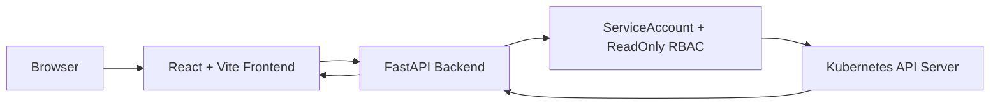

# Architecture

## MVP Architecture

## 현재 구현 상태

- Backend는 FastAPI 앱과 mock API를 제공합니다.
- Frontend는 React SPA와 mock 화면을 제공합니다.
- KubernetesClientFactory는 InClusterConfig 우선, local kubeconfig fallback 구조를 준비합니다.
- 실제 Kubernetes 조회는 다음 단계에서 서비스별로 연결합니다.

## API Prefix

- Health: `GET /health`
- MVP API: `/api/clusters/local/...`
